# 🍪 Biscuit Defect Detection: Classical ML vs. CNN vs. Transfer Learning

Automatic quality control for industrial biscuits: classifying each biscuit image as **OK** (good) or **NOK** (defective).

This project compares three approaches on the same dataset and the same train/valid/test split:

1. **Classical Machine Learning** on hand-crafted features (HOG + LBP + HSV colour histograms)
2. **A small CNN built from scratch** (TinyVGG)
3. **Transfer Learning** with a pre-trained **EfficientNet-B0**

<p align="center">
  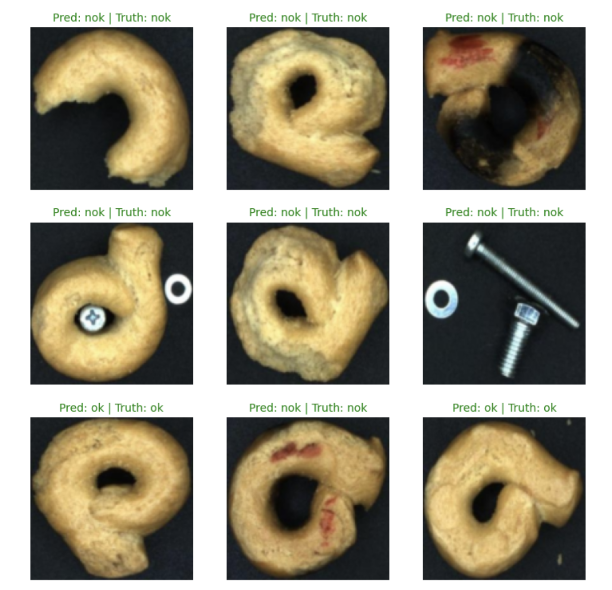
  <br>
  <em>Random samples from the dataset.</em>
</p>

---

## Table of Contents

* [Abstract](#abstract)
* [Results at a Glance](#results-at-a-glance)
* [Dataset](#dataset)
* [Repository Structure](#repository-structure)
* [Getting Started](#getting-started)
* [Approach 1: Classical Machine Learning](#approach-1-classical-machine-learning)
* [Approach 2: TinyVGG (CNN from scratch)](#approach-2-tinyvgg-cnn-from-scratch)
* [Approach 3: Transfer Learning (EfficientNet-B0)](#approach-3-transfer-learning-efficientnet-b0)
* [Links](#links)
* [License & Acknowledgements](#license--acknowledgements)

---

## Abstract

Automatic quality control is one of the important applications of image processing and AI in industrial production lines. This project studies the problem of detecting **good (OK)** and **defective (NOK)** biscuits from their images, and compares several machine-learning and deep-learning methods for this binary classification task.

After preparing and pre-processing the biscuit images, three approaches were evaluated.

After preparing and pre-processing the biscuit images, three approaches were evaluated.

First, image features (**HOG, LBP, and HSV/colour histograms**) were extracted and, after standardisation, fed to five classical classifiers: **Logistic Regression, kNN, SVM (RBF), Random Forest, and Gradient Boosting**.

Second, a simple convolutional neural network with a **TinyVGG** architecture was trained from scratch.

Third, **Transfer Learning** was applied using a pre-trained **EfficientNet-B0**.

Models were compared using Accuracy, Precision, Recall and F1-score.

TinyVGG reached **98.03 %** accuracy. Among the classical methods, **Random Forest (97.85 %)** and **SVM-RBF (97.67 %)** performed best on the validation set. EfficientNet-B0 with transfer learning reached a final accuracy of **98.57 %**. These results show that deep learning and transfer learning perform very well for automatic biscuit-quality inspection, while well-engineered classical features remain a strong, lightweight baseline.

---

## Results at a Glance

| # | Approach          | Model                          | Input                          | Evaluated on     |      Accuracy |
| - | ----------------- | ------------------------------ | ------------------------------ | ---------------- | ------------: |
| 1 | Classical ML      | Logistic Regression            | HOG + LBP + HSV hist. (1886-d) | Validation (558) |       91.76 % |
| 1 | Classical ML      | kNN (k=5)                      | same                           | Validation (558) |       82.08 % |
| 1 | Classical ML      | **SVM (RBF)**                  | same                           | Validation (558) |   **97.67 %** |
| 1 | Classical ML      | **Random Forest** (300 trees)  | same                           | Validation (558) |   **97.85 %** |
| 1 | Classical ML      | Gradient Boosting              | same                           | Validation (558) |       95.52 % |
| 2 | Deep Learning     | **TinyVGG** (from scratch)     | 128×128 RGB                    | Test (600)       |   **98.03 %** |
| 3 | Transfer Learning | **EfficientNet-B0** (ImageNet) | 224×224 RGB                    | Test (600)       | **98.57 %** ¹ |

¹ Final accuracy of the Kaggle run (see [Links](#-links)). See [Notes on Evaluation](#-notes-on-evaluation) for how the numbers should be compared.
<p align="center">
  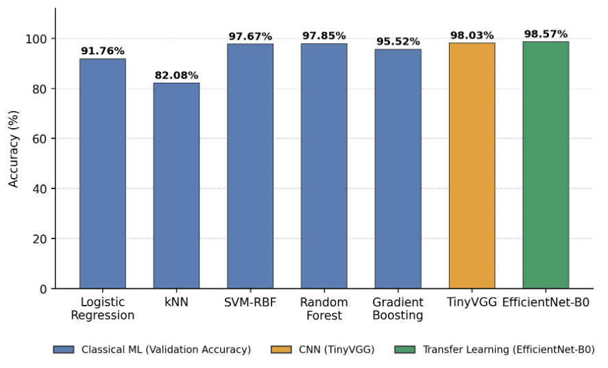
  <br>
  <em>Overview of the three approaches evaluated for biscuit defect classification.</em>
</p>

---

## Dataset

**Industry Biscuit Cookie Dataset** from Kaggle:

https://www.kaggle.com/datasets/imonbilk/industry-biscuit-cookie-dataset/data

> ⚠️ The images are **not** included in this repository. Please download them from Kaggle (see [Getting Started](#-getting-started)).

The raw dataset consists of an `Images/` folder, an `Annotations.csv` file, and a helper script (`DatasetFolder.py`) that arranges the images into class folders.

After preparation, the data used in this project is organised as:

| Split     |   OK |  NOK |    Total |
| --------- | ---: | ---: | -------: |
| `train`   | 1300 | 1300 |     2600 |
| `valid`   |  280 |  278 |      558 |
| `test`    |  300 |  300 |      600 |
| **Total** | 1880 | 1878 | **3758** |

The classes are almost perfectly balanced, so accuracy is a meaningful metric here.


Expected folder layout after preparation:

```text
IndustryBiscuit_Folders/
├── train/
│   ├── ok/
│   └── nok/
├── valid/
│   ├── ok/
│   └── nok/
└── test/
    ├── ok/
    └── nok/
```

---

## Repository Structure

```text
biscuit-defect-detection/
├── README.md
├── requirements.txt
├── .gitignore
│
├── data/                              # NOT tracked  (download from Kaggle)
│   └── IndustryBiscuit/               # raw dataset (Images/, Annotations.csv)
│       └── ...
│
├── scripts/
│   └── prepare_dataset.py             # builds train/valid/test ok/nok folders
│
├── notebooks/
│   ├── 01_classical_ml.ipynb          # HOG + LBP + colour features, 5 classifiers
│   ├── 02_tinyvgg_cnn.ipynb           # CNN from scratch
│   ├── 03_transfer_learning_efficientnet_b0.ipynb
│   └── 04_load_and_evaluate_models.ipynb # specifically designed for TinyVGG arch.
│
├── models/                            # trained weights
│   ├── tinyvgg.pth
│   └── efficientnet_b0.pth
│
└── assets/                            # figures used in this README
  
```

---

## Getting Started

### 1. Clone the repository

```bash
git clone https://github.com/<your-username>/biscuit-defect-detection.git
cd biscuit-defect-detection
```

### 2. Install dependencies

```bash
python -m venv .venv
source .venv/bin/activate        # Windows: .venv\Scripts\activate
pip install -r requirements.txt
```

Main libraries:

`torch`, `torchvision`, `torchinfo`, `torchmetrics`, `mlxtend`, `scikit-learn`, `scikit-image`, `numpy`, `pandas`, `Pillow`, `matplotlib`, `tqdm`.

### 3. Download the dataset

Download it manually from Kaggle, or with the Kaggle CLI:

```bash
pip install kaggle
kaggle datasets download -d imonbilk/industry-biscuit-cookie-dataset -p data/ --unzip
```

### 4. Prepare the train / valid / test folders

Run the helper script on the downloaded dataset to produce the `IndustryBiscuit_Folders/` structure shown above:

```bash
python scripts/prepare_dataset.py
```

> Check the paths at the top of the script (and the `DS_PATH` / `image_path` variables in the notebooks) so they point to where you placed the data.


---

## Approach 1: Classical Machine Learning

📓 Notebook: [`notebooks/01_classical_ml.ipynb`](notebooks/01_classical_ml.ipynb)

### Pipeline

1. Load images and resize them to **128×128**.
2. Extract and concatenate three complementary feature families (**1886 features** per image):

| Feature                                   | Captures      | Settings                                           | Dim. |
| ----------------------------------------- | ------------- | -------------------------------------------------- | ---: |
| **HOG** (Histogram of Oriented Gradients) | Shape / edges | 9 orientations, 16×16 px cells, 2×2 blocks, L2-Hys | 1764 |
| **LBP** (Local Binary Patterns)           | Texture       | Radius 3, 24 points, `uniform`                     |   26 |
| **HSV colour histogram**                  | Colour        | 32 bins per H/S/V channel                          |   96 |

3. Standardise features with `StandardScaler` (fit on train only).
4. Train five classifiers and compare them on the validation set.

### Models

| Model               | Key settings                                            |
| ------------------- | ------------------------------------------------------- |
| Logistic Regression | `max_iter=2000`, `class_weight='balanced'`              |
| kNN                 | `n_neighbors=5`                                         |
| SVM                 | RBF kernel, `class_weight='balanced'`                   |
| Random Forest       | 300 trees, `class_weight='balanced'`, `random_state=42` |
| Gradient Boosting   | `random_state=42`                                       |

### Validation Results

| Model               |    Accuracy | Precision (NOK) | Recall (NOK) | 
| ------------------- | ----------: | --------------: | -----------: | 
| Logistic Regression |     91.76 % |            0.89 |         0.95 | 
| kNN                 |     82.08 % |            1.00 |         0.64 | 
| **SVM (RBF)**       | **97.67 %** |            1.00 |         0.95 | 
| **Random Forest**   | **97.85 %** |            0.96 |         1.00 | 
| Gradient Boosting   |     95.52 % |            0.92 |         1.00 | 

NOK is treated as the positive class. Random Forest misses only **1 defective biscuit**, which is particularly important in quality-control applications.

### Visualisations

**Sample images**

<p align="center">
  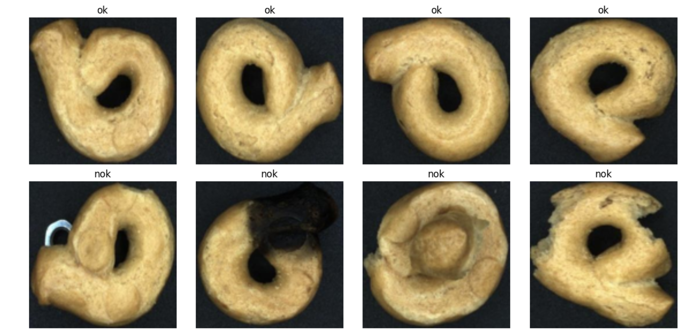
</p>
<table align="center">
  <tr>
    <td align="center">
      <strong>Confusion Matrices</strong><br><br>
      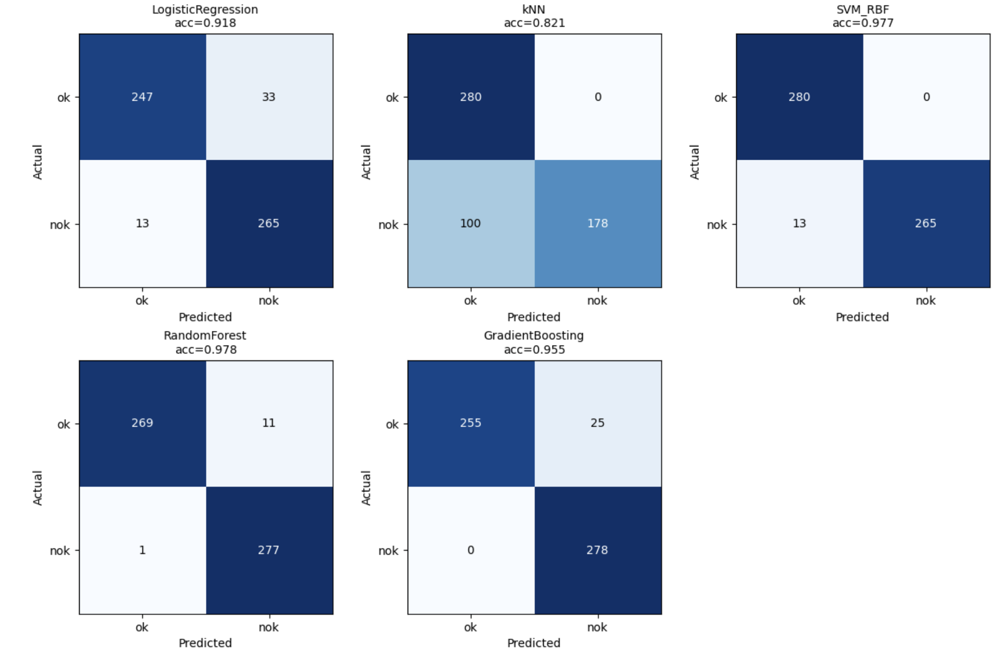
    </td>
    <td align="center">
      <strong>Accuracy Comparison</strong><br><br>
      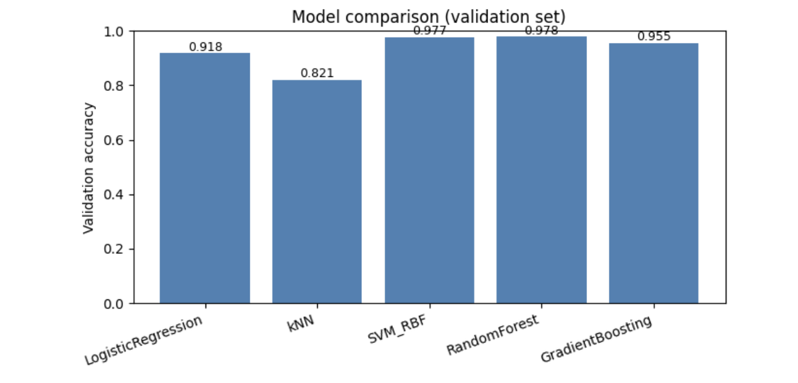
    </td>
  </tr>
</table>

<table align="center">
  <tr>
    <td align="center">
      <strong>ROC Curves and AUC</strong><br><br>
      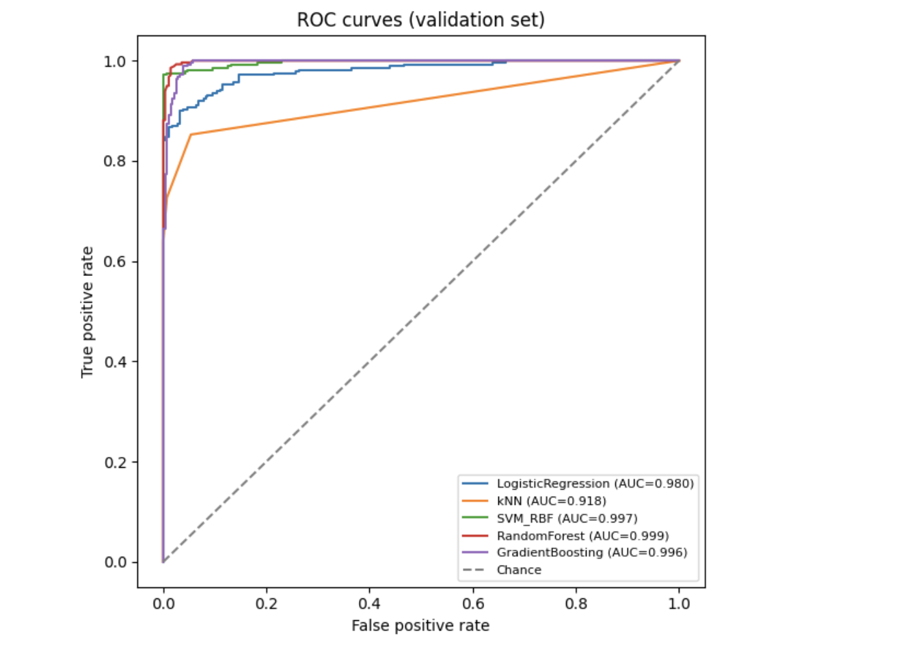
    </td>
    <td align="center">
      <strong>Feature Importance by Family</strong><br><br>
      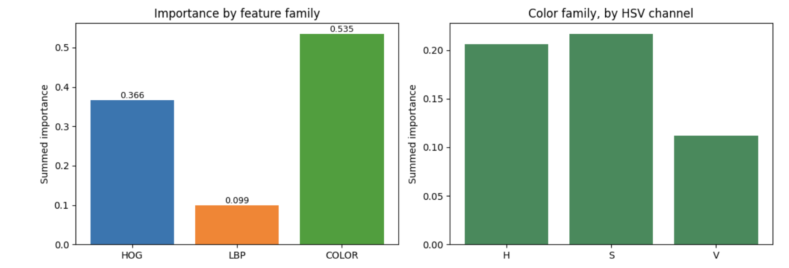
    </td>
  </tr>
</table>


## Approach 2: TinyVGG (CNN from scratch)

📓 Notebooks:

* [`notebooks/02_tinyvgg_cnn.ipynb`](notebooks/02_tinyvgg_cnn.ipynb)
* [`notebooks/04_load_and_evaluate_models.ipynb`](notebooks/04_load_and_evaluate_models.ipynb)

### Architecture

TinyVGG consists of two convolutional blocks followed by a linear classifier.

```text
Input (3×128×128)
 ├─ Conv(3→10, 3×3) → ReLU → Conv(10→10, 3×3) → ReLU → MaxPool(2)
 ├─ Conv(10→10, 3×3) → ReLU → Conv(10→10, 3×3) → ReLU → MaxPool(2)
 └─ Flatten → Linear(10·29·29 → 2)
```
<p align="center">
  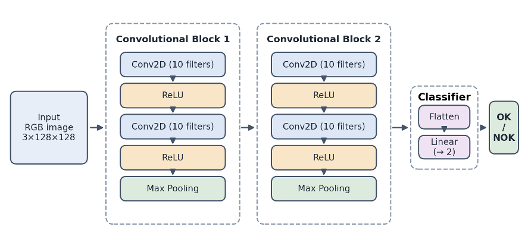
  <br>
  <em>Architecture of the TinyVGG convolutional neural network used for biscuit classification.</em>
</p>

For an interactive visual explanation of how convolutional neural networks work, see the <a href="https://poloclub.github.io/cnn-explainer/">CNN Explainer</a>.

### Training Configuration

| Setting               | Value                               |
| --------------------- | ----------------------------------- |
| Image size            | 128 × 128                           |
| Augmentation (train)  | `RandomHorizontalFlip(p=0.5)`       |
| Batch size            | 32                                  |
| Optimiser             | Adam                                |
| Initial learning rate | `0.001`                             |
| Learning rate         | Reduced to `0.0001` during training |
| Loss                  | Cross-Entropy                       |
| Epochs                | 32                                  |

**Final test accuracy: 98.03 %**

### Visualisations

<table align="center">
  <tr>
    <td align="center">
      <strong>Loss & Accuracy Curves</strong><br><br>
      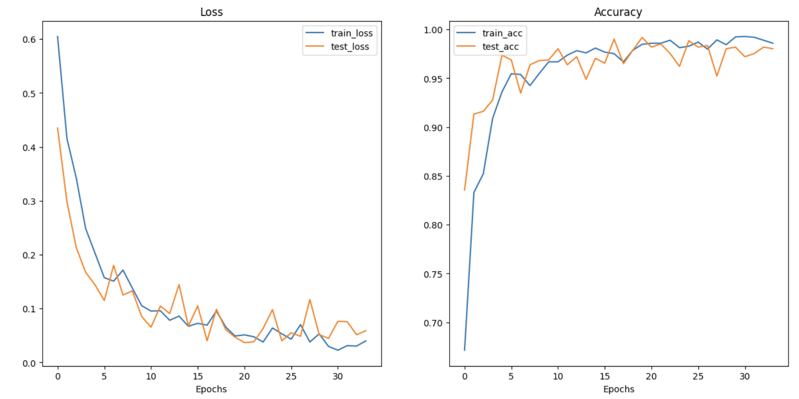
    </td>
    <td align="center">
      <strong>Confusion Matrix</strong><br><br>
      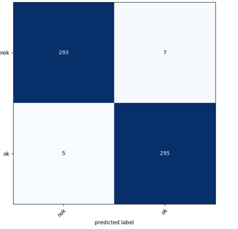
    </td>
  </tr>
</table>


## Approach 3: Transfer Learning (EfficientNet-B0)

📓 Notebook: [`notebooks/03_transfer_learning_efficientnet_b0.ipynb`](notebooks/03_transfer_learning_efficientnet_b0.ipynb)

🔗 Kaggle version: [biscuit-efficientnet-b0](https://www.kaggle.com/code/zahrakhodamoradi/biscuit-efficientnet-b0)

### Idea

Reuse an EfficientNet-B0 pre-trained on ImageNet and adapt it to the biscuit classification task.

### Training Configuration

| Setting               | Value                                                      |
| --------------------- | ---------------------------------------------------------- |
| Backbone              | `torchvision.models.efficientnet_b0` (ImageNet-1K weights) |
| Frozen layers         | All of `features`, except the last block (`features[-1]`)  |
| New classifier head   | `Dropout(0.2)` → `Linear(1280 → 2)`                        |
| Input                 | 224 × 224                                                  |
| Normalisation         | ImageNet mean/std                                          |
| Batch size            | 32                                                         |
| Optimiser             | Adam                                                       |
| Initial learning rate | `0.001`                                                    |
| Learning rate         | Reduced to `0.0001` during training                        |
| Loss                  | Cross-Entropy                                              |
| Epochs                | 8                                                          |

**Final reported accuracy: 98.57 %**

The final reported accuracy comes from the Kaggle run linked above.

### Visualisations
**EfficientNet-B0 Architecture Summary**
<p align="center">
  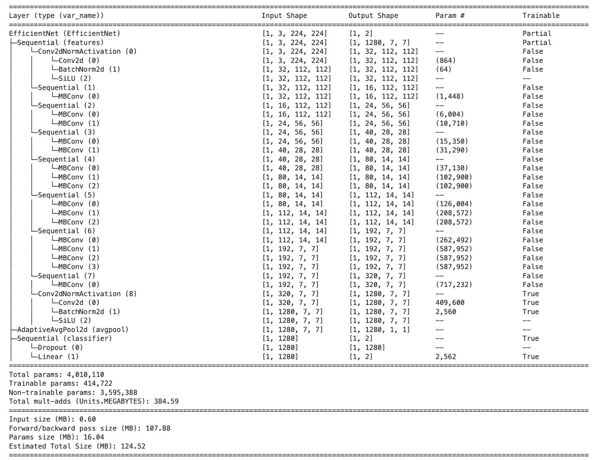
  <br>
  <em>EfficientNet-B0 architecture and parameter summary after fine-tunning.</em>
</p>


<table align="center">
  <tr>
    <td align="center">
      <strong>Loss & Accuracy Curves</strong><br><br>
      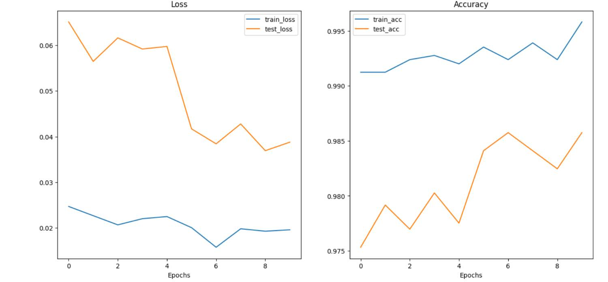
    </td>
    <td align="center">
      <strong>Confusion Matrix</strong><br><br>
      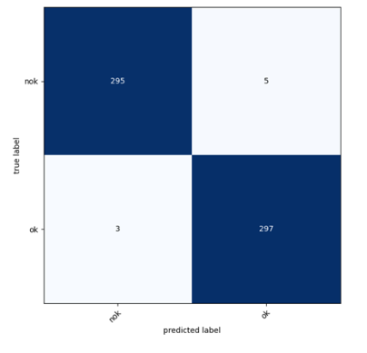
    </td>
  </tr>
</table>

---

## 🔗 Links

| Resource | Link |
|----------|------|
| Dataset (Kaggle) | <https://www.kaggle.com/datasets/imonbilk/industry-biscuit-cookie-dataset/data> |
| EfficientNet-B0 notebook (Kaggle) | <https://www.kaggle.com/code/zahrakhodamoradi/biscuit-efficientnet-b0> |

---

## License & Acknowledgements

- Code in this repository is released under the **MIT License** (add a `LICENSE` file).
- The dataset belongs to its original authors; please follow the licence stated on its [Kaggle page](https://www.kaggle.com/datasets/imonbilk/industry-biscuit-cookie-dataset/data).
- Pre-trained weights: EfficientNet-B0 (ImageNet-1K) from `torchvision`.
